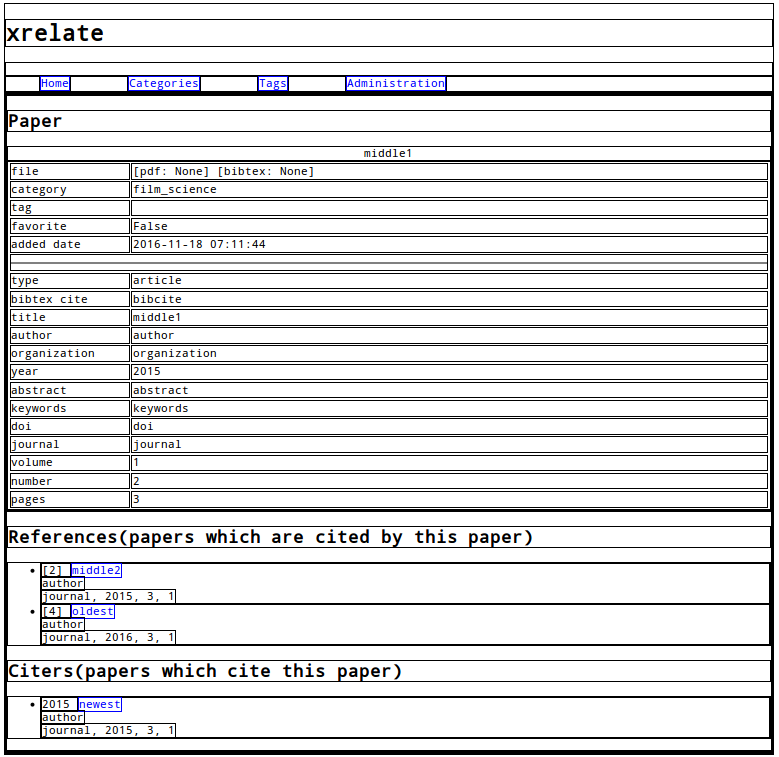

# xrelate
这是一个使用 Django 框架编写的文献管理系统。它可以存储文献引用和被引的关系，而且包含参考文献的引用序号（如图）。

# Status
## Done
* reference save, edit, delete, display as list by category, tag.
* add pdf file
* add bibtex file, parse it, then get information of the reference
* reference relation, list references, citers

## Undone
* list cociters, coreferences
* bibtex parse result check

TODO add others

# Program structure
Typical structure of Django

TODO explain the files.

# Develop environment
* Python 2.7.9
* Django 1.9.8
* Pybtex 0.20.1

TODO setting help
